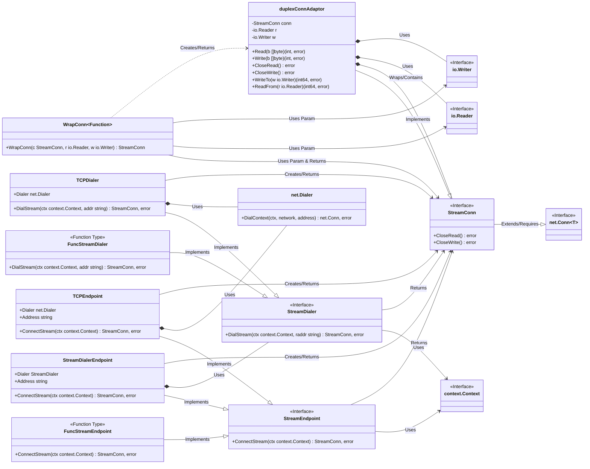

```mermaid
classDiagram
    direction LR  // Layout direction: Left-to-Right

    %% --- Interfaces ---
    class net.Conn~T~ {
        <<Interface>>
        %% Methods omitted for brevity
    }
    class io.Reader { <<Interface>> }
    class io.Writer { <<Interface>> }
    class net.Dialer {
      +DialContext(ctx, network, address) net.Conn, error
    }
    class context.Context { <<Interface>> }

    class StreamConn {
        <<Interface>>
        +CloseRead() error
        +CloseWrite() error
    }
    StreamConn --|> net.Conn : Extends/Requires

    class StreamEndpoint {
        <<Interface>>
        +ConnectStream(ctx context.Context) StreamConn, error
    }
    StreamEndpoint --> context.Context : Uses
    StreamEndpoint --> StreamConn : Returns

    class StreamDialer {
        <<Interface>>
        +DialStream(ctx context.Context, raddr string) StreamConn, error
    }
    StreamDialer --> context.Context : Uses
    StreamDialer --> StreamConn : Returns

    %% --- Structs & Implementations ---
    class duplexConnAdaptor {
        -StreamConn conn
        -io.Reader r
        -io.Writer w
        +Read(b []byte) (int, error)
        +Write(b []byte) (int, error)
        +CloseRead() error
        +CloseWrite() error
        +WriteTo(w io.Writer) (int64, error)
        +ReadFrom(r io.Reader) (int64, error)
    }
    duplexConnAdaptor --|> StreamConn : Implements
    duplexConnAdaptor *-- StreamConn : Wraps/Contains
    duplexConnAdaptor *-- io.Reader : Uses
    duplexConnAdaptor *-- io.Writer : Uses

    class TCPEndpoint {
        +Dialer net.Dialer
        +Address string
        +ConnectStream(ctx context.Context) StreamConn, error
    }
    TCPEndpoint --|> StreamEndpoint : Implements
    TCPEndpoint *-- net.Dialer : Uses
    TCPEndpoint --> StreamConn : Creates/Returns

    class StreamDialerEndpoint {
        +Dialer StreamDialer
        +Address string
        +ConnectStream(ctx context.Context) StreamConn, error
    }
    StreamDialerEndpoint --|> StreamEndpoint : Implements
    StreamDialerEndpoint *-- StreamDialer : Uses
    StreamDialerEndpoint --> StreamConn : Creates/Returns

    class TCPDialer {
        +Dialer net.Dialer
        +DialStream(ctx context.Context, addr string) StreamConn, error
    }
    TCPDialer --|> StreamDialer : Implements
    TCPDialer *-- net.Dialer : Uses
    TCPDialer --> StreamConn : Creates/Returns


    %% --- Function Types & Implementations ---
    class FuncStreamEndpoint {
        <<Function Type>>
        +ConnectStream(ctx context.Context) StreamConn, error
    }
    FuncStreamEndpoint --|> StreamEndpoint : Implements


    class FuncStreamDialer {
        <<Function Type>>
        +DialStream(ctx context.Context, addr string) StreamConn, error
    }
    FuncStreamDialer --|> StreamDialer : Implements

    %% --- Functions ---
    class WrapConn~Function~ {
       +WrapConn(c StreamConn, r io.Reader, w io.Writer) StreamConn
    }
    WrapConn --> StreamConn : Uses Param & Returns
    WrapConn --> io.Reader : Uses Param
    WrapConn --> io.Writer : Uses Param
    WrapConn ..> duplexConnAdaptor : Creates/Returns
```
