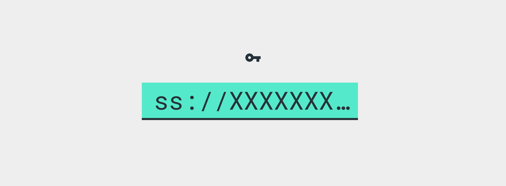
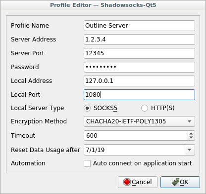

# Invitation instructions

Have an invitation to connect to an Outline server? Follow these instructions to access to the open internet from your device. No personal information will be collected.

## 1. Copy your access key

`ss://xxx` located at the bottom of your invitation email or message. The Outline app will instantly add this server from your clipboard.


## 2. Install Outline


|Download|  |
| ------------- | ------------- |
| [Android ›](https://play.google.com/store/apps/details?id=org.outline.android.client) | If Google Play is not accessible, [get it here](https://github.com/Jigsaw-Code/outline-releases/blob/master/client/Outline.apk?raw=true). |
| [iOS ›](https://itunes.apple.com/app/outline-app/id1356177741) | Get Outline on the App Store |
| [Windows ›](https://raw.githubusercontent.com/Jigsaw-Code/outline-releases/master/client/Outline-Client.exe) | Download Outline.exe and double click to launch. |
| [macOS ›](https://itunes.apple.com/app/outline-app/id1356178125) | Download outline.dmg, double click to install. Add Outline to your applications folder, double click to launch. |
| Linux | See Linux set-up instructions below. |


## 3. Add server and connect

Open the app and confirm your new server. Tap or click to connect.
**Having trouble?** Try copying your access key again to add your server.


## Linux set-up instructions

1. Download the [Shadowsocks QT5 client](https://github.com/shadowsocks/shadowsocks-qt5/releases/latest).
2. Change directory to the downloaded file location and run:
  ```
    chmod a+x Shadowsocks-Qt5-*.AppImage && ./Shadowsocks-Qt5-*.AppImage
  ```
3. Go to 'Connection' -> 'Add' -> 'URI' and paste the access key (`ss://xxx`).
4. Choose an unused local port for the connection. Try 1080!



5. Right-click on the newly added connection row, and click 'Connect'.


6. Go to your browser and applications and point them to use a SOCKS5 proxy, on localhost, on the local port you selected on step 5.
