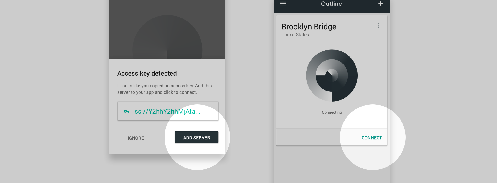

# Invitation instructions

Have an invitation to connect to an Outline server? Follow these instructions to access to the open internet from your device. No personal information will be collected.

## 1. Copy your access key

`ss://xxx` located at the bottom of your invitation email or message. The Outline app will instantly add this server from your clipboard.

## 2. Install Outline

|Download|  |
| ------------- | ------------- |
| [Android ›](https://play.google.com/store/apps/details?id=org.outline.android.client) | If Google Play is not accessible, [get it here](https://github.com/Jigsaw-Code/outline-releases/blob/master/client/Outline.apk?raw=true). |
| [iOS ›](https://itunes.apple.com/app/outline-app/id1356177741) | Get Outline on the App Store |
| [Windows ›](https://s3.amazonaws.com/outline-releases/client/Outline-Client.exe) | Download Outline.exe and double click to launch. |
| [macOS ›](https://itunes.apple.com/app/outline-app/id1356178125) | Download outline.dmg, double click to install. Add Outline to your applications folder, double click to launch. |
| [Linux ›]( https://s3.amazonaws.com/outline-releases/client/Outline-Client.AppImage) | Download Outline.AppImage, [make it executable](https://docs.appimage.org/introduction/quickstart.html), then double click to launch. |

## 3. Add server and connect

Open the app and confirm your new server. Tap or click to connect.
**Having trouble?** Try copying your access key again to add your server.
