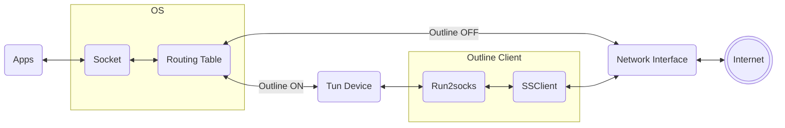

# Life of a Packet

```mermaid
flowchart LR
  A(Apps) <--> S(Socket)
  subgraph OS
    S <--> R(Routing Table)
  end
  R <-- Outline OFF --> IF(Network Interface)
  IF <--> INET(((Internet)))
  R <-- Outline ON --> TUN(Tun Device)
  TUN <--> T2S(Run2socks)
  subgraph Outline Client
    T2S <--> SC(SSClient)
  end
  SC <--> IF
```
